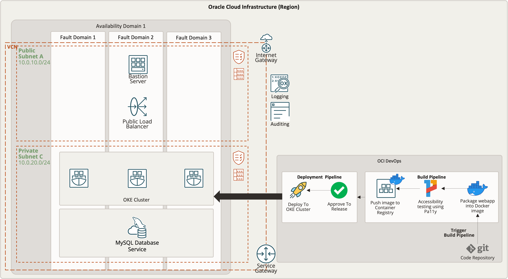

# Deployment Path: Mix and Match with CICD

## How It Works



## Let's build it

**a. Create OKE Kubernetes cluster. VCN and corresponding network resources will be created automatically.**
    
1. Click the Navigation Menu in the upper left, navigate to Developer Services, select Kubernetes Clusters (OKE)


2. Choose Quick Create as it will create the new cluster along with the new network resources such as Virtual Cloud Network (VCN), Internet Gateway (IG), NAT Gateway (NAT), Regional Subnet for worker nodes, and a Regional Subnet for load balancers. Select Launch Workflow

3. Keep the name to cluster1 and the other default values, click Next to review the cluster settings.

4. Click Create


**b. Create a bastion host compute instance**

1. Click the Navigation Menu in the upper left, navigate to Compute, select Instances


2. Click Create Instance

3. Change Name to Operator

4. In Networking section, select VCN and public subnet created with OKE

5. In Add SSH keys section, click Save Private Key and Save Public Key to save private and public keys for SSH access


6. Click Create

**c. Create a MySQL Database Service instance**

1. Click the Navigation Menu in the upper left, navigate to Databases, select MySQL DB Systems


2. Click Create MySQL DB System


3. In Create Administrator credentials section, enter admin username and password

4. In Configure networking section, select the VCN and private subnet created with OKE

5. Click Create

**d. Set up schema and data in MySQL DB System**

1. SSH to bastion host from cloud shell

2. Install MySQL Shell on bastion host

3. Connect to MySQL DB System with MySQL Shell
    ```
    mysqlsh -h <MDS host> -p ‘<MDS password>' -u <MDS user>
    ```

4. Create database and table
    ```
    \sql
	CREATE DATABASE webappdb;
    use webappdb;
    CREATE TABLE `employee_data`( `id` int(11) NOT NULL AUTO_INCREMENT PRIMARY KEY, `first_name` VARCHAR(50) NOT NULL, `last_name` VARCHAR(50) NOT NULL, `gender` VARCHAR(50) NOT NULL, `email` VARCHAR(50) NOT NULL, `hire_date` VARCHAR(50) NOT NULL, `department` VARCHAR(50) NOT NULL, `job` VARCHAR(50) NOT NULL, `salary` DECIMAL(10,2) NOT NULL )AUTO_INCREMENT=1;
    show tables;
    ```

**e. Set up Container Registry**

1. Click the Navigation Menu on the upper left, navigate to **Developer Services**, click on **Container Registry** under **Containers & Artifacts**.

2. Click Create repository, type `webapp/php` as the Repository name, select Public and click **Create repository**.

3. Repeat step 2 and change the Repository name to `webapp/nginx`.

**f. Set up CICD pipeline in OCI DevOps**

1. Click the Navigation Menu on the upper left, navigate to **Developer Services**, click on **Projects** under **DevOps**.

2. Click **Create DevOps Projects** and key in Project name, Project description, select the Notification Topic for OCI DevOps service to send messages for important events, then click **Create DevOps project**.

    2.1 If Notification Topic is not created, click the Navigation Menu on the upper left, navigate to **Developer Services**, click on **Notifications** under **Application Integration**.

    2.2 Click **Create Topic** and key in Name and Description for the topic, then click **Create**.

    2.3 When the topic is active, click the topic name, then click **Create Subscription**. Select **Email** as the Protocol, key in the email of the notification recipient and click **Create**.

3. In the project page, click **Logs** on the left menu panel and toggle the **Enable Log** option to enable logging for DevOps project. Click **Create a new Log Group** and key in Name and Description of the Log Group. Keep the remaining options as default and click **Enable Log**.

4. Set up OCI Code Repository and push source code to the repository.

    4.1 Click **Code Repositories** on the left menu panel and click **Create repository**. Key in Repository name, Description and set Default branch as **main**, then click **Create repository**.

    4.2 Create Auth Token to authenticate to OCI Code Repository. Follow the steps in this [link](https://docs.oracle.com/en-us/iaas/Content/devops/using/getting_started.htm#authtoken)

    4.3 Add OCI Code Repository as a remote. The repo URL can be found by clicking **Clone**.

    ```
    git remote add oci-code-repo <repo_url> --mirror=push
    ```

    4.4 Push the source code to OCI Code Repository.

    ```
    git push oci-code-repo
    ```

    When prompt for username, key in the username as `<TenancyName>/<Federation>/<UserName>`for federated user or `<TenancyName>/<YourUserName>` for OCI IAM user. `<TenancyName>`, `<Federation>` and `<UserName>` can be found by clicking the user icon on the top right of the web console.
    
    Key in the Auth Token created in step 4.2 as the password.

5. Set up deployment environment

    5.1 Click **Environments** on the left menu panel and click **Create environment**. Select `Oracle Kubernetes Engine` as the Environement type, key in Name and Description, then click **Next**.

    5.2 Select the region and compartment where the OKE cluster is hosted, select the cluster and click **Create environment**.

6. Set up deployment artifacts

    6.1 Click **Artifacts** on the left menu panel and click **Add artifact**. Key in Name, select `Kubernetes manifest` as the Type, select `Inline` as the Artifact source, copy the content of the kubernetes manifest file in `2b_mixmatch_cicd/deploy/deploy-webapp.yml` and paste it to the Value section.

    6.2 Update the values for mysql-host, mysql-database, mysql-user and mysql-password in line 13, 22, 23 and 24 respectively.
    
    6.3 Update the image repo URL for php and nginx in line 82 and 135 respectively. You may find the `<region_key>` for your region in this [link](https://docs.oracle.com/en-us/iaas/Content/General/Concepts/regions.htm) and `<tenancy_namespace>` can be found by clicking on the container repository in the Container Registry service.
    
    6.3 Finally, click **Add**.

7. Set up deployment pipelines

    7.1 Click **Deployment pipelines** on the left menu panel and click **Add pipeline**. Key in Pipeline name and Description, then click **Create pipeline**.

    7.2 On the deployment pipeline page, click the plus icon, click **Add stage**, select **Apply manifest to your Kubernetes cluster** option and click **Next**.

    7.3 Key in Stage name, Description, choose the environment you created in step 5, click **Select Artifact**, tick on the artifact your created in step 6, click **Save Change**, then click **Add**.

    7.4 `[Optional]` Click the plus icon above the deploy to OKE stage, click **Add stage**, select **Pause the deployment for approvals** option and click **Next**.

    7.5 `[Optional]` Key in Stage name, Description and click **Add**.


8. Set up build pipeline

    8.1 Click **Build Pipelines** on the left menu panel and click **Create build pipeline**. Key in Name and Description, then click **Create**.

    8.2 Click on the build pipeline name to edit the pipeline. Click the plus icon, click **Add stage**, select **Manage Build** option and click **Next**. 

    8.3 Key in Staga name, Description, type `2b_mixmatch_cicd/build/build_spec.yml` on **Build spec file path**, click **Select** on Primary code repository and select **OCI Code Repository** as Connection Type, tick on the OCI Code Repository name, type `oci-code-repo` on **Build source name**, then click **Save**. Finally, click **Add**.

    8.4 Click the plus icon below the manage build stage, click **Add stage**, select **Trigger deployment** option and click **Next**.

    8.5 Key in Stage name, Description, click **Select deployment pipeline**, tick the deployment pipeline you created in step 7, click **Save**, make sure **Send build pipelines Parameters** is ticked, then click **Add**.

9. Set up pipeline auto-trigger

    9.1 Click **Triggers** on the left menu panel and click **Create Trigger**. Key in Name, Description, select **OCI code repository** as the Source connection, click **Select**, tick the OCI code repository you created in step 4 and click **Save**, click **Add action**, click **Select**, tick the build pipeline you created in step 8 and click **Save**, tick on **Push** Event, type `main` in Source branch and click **Save**. Finally click **Create**.

10. Update the build spec file located in 2b_mixmatch_cicd/build/build_spec.yml

    10.1 Change the `<php_container_repo>` in line 27, 29 and 89 to `<region-key>.ocir.io/<tenancy-namespace>/php-webapp`.

    10.2 Change the `<nginx_container_repo>` in line 41, 43 and 87 to `<region-key>.ocir.io/<tenancy-namespace>/nginx-webapp`.

    10.3 You may find the `<region-key>` for your region in this [link](https://docs.oracle.com/en-us/iaas/Content/General/Concepts/regions.htm) and `<tenancy-namespace>` can be found by clicking on the container repository in the Container Registry service.

    10.4 Update the `<region-key>`, `<Username>` and `<Auth_Token>` in line 85. `<Username>` is `<TenancyName>/<Federation>/<UserName>`for federated user or `<TenancyName>/<YourUserName>` for OCI IAM user. `<Auth_Token>` is the one created in step 4.2. `<TenancyName>`, `<Federation>` and `<UserName>` can be found by clicking the user icon on the top right of the web console.

    **Note**: For production implementation, please use OCI Vault to store the Auth_Token instead of inserting it in the build spec file as clear text. Refer to this [link](https://docs.oracle.com/en-us/iaas/Content/devops/using/build_specs.htm) on how to add secret in OCI Vault as a variable in a build spec file.

11. Trigger the CICD pipeline. As auto-trigger has been created in step 9, the build pipeline will be triggered automatically when the code is pushed to main branch in the OCI code repository.

```
git push oci-code-repo
```

## Resources

[LiveLabs](https://apexapps.oracle.com/pls/apex/dbpm/r/livelabs/view-workshop?wid=651&clear=180&session=3650076810239)

[Refernce Architecture](https://docs.oracle.com/en/solutions/ha-web-app/index.html)

[MAD Framwork](https://docs.oracle.com/en/solutions/mad-web-mobile/index.html)

[OKE Documentation](https://docs.oracle.com/en-us/iaas/Content/ContEng/home.htm)

[MDS Documentation](https://docs.oracle.com/en-us/iaas/mysql-database/index.html)

[OCI DevOps Documentation](https://docs.oracle.com/en-us/iaas/Content/devops/using/home.htm)