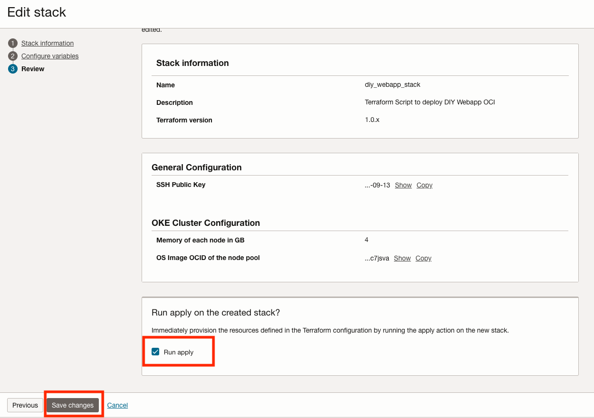

# Deployment Path: DIY with CICD

## How It Works


## Let's build it

**a. Provision resources using OCI Resource Manager**

1. Press the button below to provision the resources through OCI Resource Manager.

    [](https://cloud.oracle.com/resourcemanager/stacks/create?zipUrl=https://<replace_zipfile>)

2. Input the configurations. You will need to upload an openssh public key.
3. Click Next.
4. Check the "Run apply" button and press "Save changes" to run the job.

    

5. Wait for the job to complete.
6. When the job is completed, click on the "Application information" tab and click on the Bastion URL.
7. Under "Sessions", click on the 3 dots and press "Copy SSH command".

    
    
8. Paste the SSH command on your favourite terminal to access the MySQL Database Service instance via OCI Bastion.

**b. Set up schema and data in MySQL Database**

1. Create database and table
    ```
	CREATE DATABASE webappdb;
    use webappdb;
    CREATE TABLE `employee_data`( `id` int(11) NOT NULL AUTO_INCREMENT PRIMARY KEY, `first_name` VARCHAR(50) NOT NULL, `last_name` VARCHAR(50) NOT NULL, `gender` VARCHAR(50) NOT NULL, `email` VARCHAR(50) NOT NULL, `hire_date` VARCHAR(50) NOT NULL, `department` VARCHAR(50) NOT NULL, `job` VARCHAR(50) NOT NULL, `salary` DECIMAL(10,2) NOT NULL )AUTO_INCREMENT=1;
    show tables;
    ```

**c. Deploy webapp using OCI DevOps Deployment Pipeline**

1. Go back to OCI Resource Manager console, click on the "Application information" tab and click on the Deployment Pipeline URL to access the deployment pipeline.
2. Press "Run pipeline" and press "Start manual run" to deploy the webapp to OKE.

**d. Access the Webapp**

1. Go back to OCI Resource Manager console, click on the "Application information" tab and click on the Webapp URL to access the application.