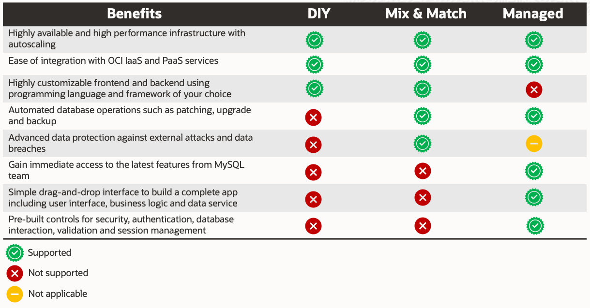

# oci-developer-incubator

 

## THIS IS A NEW REPO THAT IS NOT READY FOR USE YET.  PLEASE CHECK BACK SOON!

## Introduction
This repository provides Web App use case with 6 different deployment paths for you to choose from based on your preference and requirements. As each path comes with its own benefits, refer to the table below to guide you in making an informed decision.

Continuous Integration and Continuous Delivery **(CI/CD)** accelerates app development by introducing automation into the stages of app development including build, test and deploy. Choose this option to adopt agile app development principles.

* **1a. DIY**

    Deploy Nginx & PHP Webapp on Oracle Container Enginer for Kubernetes (OKE) and connect to self-hosted MySQL CE

         

* **1b. DIY with CI/CD**

    Build, test and deploy Nginx & PHP Webapp on Oracle Container Enginer for Kubernetes (OKE) using OCI DevOps and connect to self-hosted MySQL CE

    

* **2a. Mix and Match**

    Deploy Nginx & PHP Webapp on Oracle Container Enginer for Kubernetes (OKE) and connect to OCI MySQL Database Service (MDS)

    

* **2b. Mix and Match with CI/CD**

    Build, test and deploy Nginx & PHP Webapp on Oracle Container Enginer for Kubernetes (OKE) and connect to OCI MySQL Database Service (MDS)

    

* **3a. Managed**

    Deploy Webapp using Application Express (APEX) on Autonomous Database 

    

* **3b. Managed with CI/CD**

    Build, test and deploy Webapp using Application Express (APEX) on Autonomous Database 

    

## Getting Started
Click into the deployment path of your choice for more details and deployment instructions. You may also click on the  button above to automate the deployment using OCI Resource Manager. 

### Prerequisites
Familiarity with webapp development and Oracle Cloud Infrastructure (OCI) is desireable but not required.

## Notes/Issues
Architectures shown are not meant for production deployment. Please refer to [Oracle Reference Architecture](https://docs.oracle.com/en/solutions/ha-web-app/index.html) for best practices.

## URLs
* [Oracle Reference Architecture](https://docs.oracle.com/en/solutions/ha-web-app/index.html)
* [OCI Container Engine for Kubernetes](https://docs.oracle.com/en-us/iaas/Content/ContEng/Concepts/contengoverview.htm)
* [MySQL Database Service](https://docs.oracle.com/en-us/iaas/mysql-database/doc/overview-mysql-database-service.html)
* [Oracle APEX](https://docs.oracle.com/en/database/oracle/apex/index.html)

## Contributing
This project is open source.  Please submit your contributions by forking this repository and submitting a pull request!  Oracle appreciates any contributions that are made by the open source community.

## License
Copyright (c) 2022 Oracle and/or its affiliates.

Licensed under the Universal Permissive License (UPL), Version 1.0.

See [LICENSE](LICENSE) for more details.

ORACLE AND ITS AFFILIATES DO NOT PROVIDE ANY WARRANTY WHATSOEVER, EXPRESS OR IMPLIED, FOR ANY SOFTWARE, MATERIAL OR CONTENT OF ANY KIND CONTAINED OR PRODUCED WITHIN THIS REPOSITORY, AND IN PARTICULAR SPECIFICALLY DISCLAIM ANY AND ALL IMPLIED WARRANTIES OF TITLE, NON-INFRINGEMENT, MERCHANTABILITY, AND FITNESS FOR A PARTICULAR PURPOSE.  FURTHERMORE, ORACLE AND ITS AFFILIATES DO NOT REPRESENT THAT ANY CUSTOMARY SECURITY REVIEW HAS BEEN PERFORMED WITH RESPECT TO ANY SOFTWARE, MATERIAL OR CONTENT CONTAINED OR PRODUCED WITHIN THIS REPOSITORY. IN ADDITION, AND WITHOUT LIMITING THE FOREGOING, THIRD PARTIES MAY HAVE POSTED SOFTWARE, MATERIAL OR CONTENT TO THIS REPOSITORY WITHOUT ANY REVIEW. USE AT YOUR OWN RISK. 